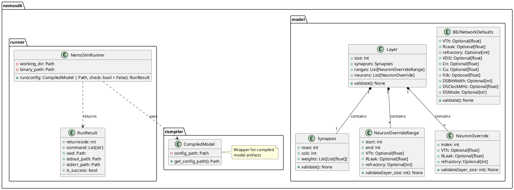
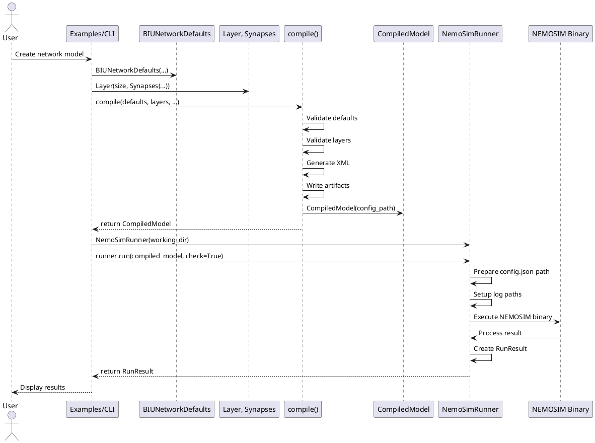
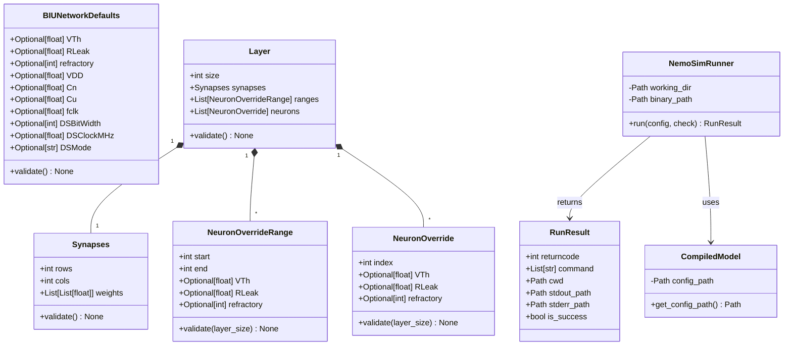
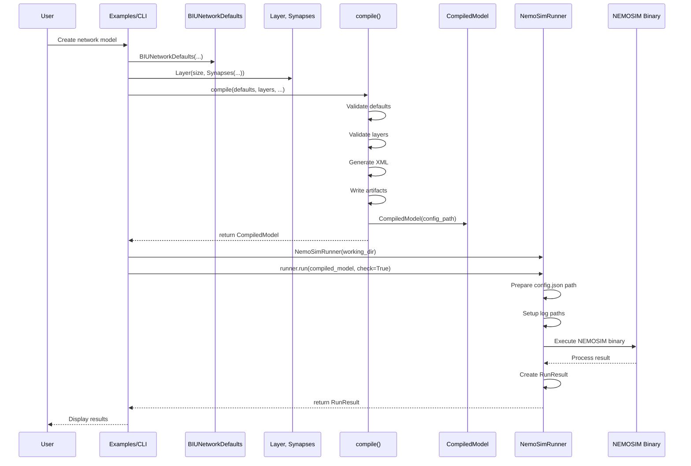

# Creating Class and Sequence Diagrams for NemoSDK

This guide explains multiple approaches to create UML class diagrams and sequence diagrams for the NemoSDK project.

## Overview

The NemoSDK has the following main components:

### Main Classes (from `nemosdk/model.py`)
- `BIUNetworkDefaults`: Global network configuration defaults
- `Synapses`: Synapse connection matrix
- `NeuronOverrideRange`: Per-neuron range overrides
- `NeuronOverride`: Single neuron overrides
- `Layer`: Network layer definition

### Main Classes (from `nemosdk/compiler.py`)
- `CompiledModel`: Wrapper for compiled model artifacts

### Main Classes (from `nemosdk/runner.py`)
- `NemoSimRunner`: Simulator execution runner
- `RunResult`: Execution result summary

## Method 1: Using pyreverse (PyUML) - Automated Class Diagrams

`pyreverse` (part of pylint) can automatically generate class diagrams from Python code.

### Installation
```bash
pip install pylint
```

### Generate Class Diagrams
```bash
# Generate class diagram for the entire nemosdk package
pyreverse -o png -p NemoSDK nemosdk/

# Or generate as Graphviz DOT file (more control)
pyreverse -o dot -p NemoSDK nemosdk/
dot -Tpng classes_NemoSDK.dot -o class_diagram.png

# Generate separate diagrams for each module
pyreverse -o png nemosdk/model.py
pyreverse -o png nemosdk/compiler.py
pyreverse -o png nemosdk/runner.py
```

## Method 2: Using PlantUML - Text-Based Diagrams

PlantUML uses text-based syntax to generate diagrams. Great for version control.

### Installation
```bash
# Option 1: Java-based (requires Java)
# Download from https://plantuml.com/download
java -jar plantuml.jar diagram.puml

# Option 2: Python package (wrapper)
pip install plantuml
```

### Create Class Diagram (`docs/diagrams/class_diagram.puml`)


### Create Sequence Diagram (`docs/diagrams/sequence_diagram.puml`)


## Method 3: Using Mermaid - Markdown-Compatible Diagrams

Mermaid diagrams can be embedded in Markdown files and rendered by many tools.

### Create Class Diagram (`docs/diagrams/class_diagram.md`)


### Create Sequence Diagram (`docs/diagrams/sequence_diagram.md`)


## Method 4: Using Graphviz - Programmatic Diagrams

Install Graphviz and use the DOT language directly or through Python.

### Installation
```bash
# System package
sudo apt-get install graphviz  # Debian/Ubuntu
brew install graphviz          # macOS

# Python wrapper
pip install graphviz
```

### Python Script Example
See `scripts/generate_diagrams.py` (if created) for automated generation.

## Method 5: Online Tools

- **draw.io** (diagrams.net): Free, browser-based, supports UML
- **Lucidchart**: Commercial, professional UML tools
- **Visual Paradigm**: Commercial, comprehensive UML support
- **PlantUML Online**: http://www.plantuml.com/plantuml/uml/

## Recommended Workflow

1. **For quick automated diagrams**: Use `pyreverse`
2. **For version-controlled, text-based diagrams**: Use PlantUML
3. **For documentation in Markdown**: Use Mermaid
4. **For custom/professional diagrams**: Use draw.io or PlantUML

## Next Steps

1. Install your preferred tool
2. Run the generation commands
3. Review and refine the diagrams
4. Add diagrams to your documentation
