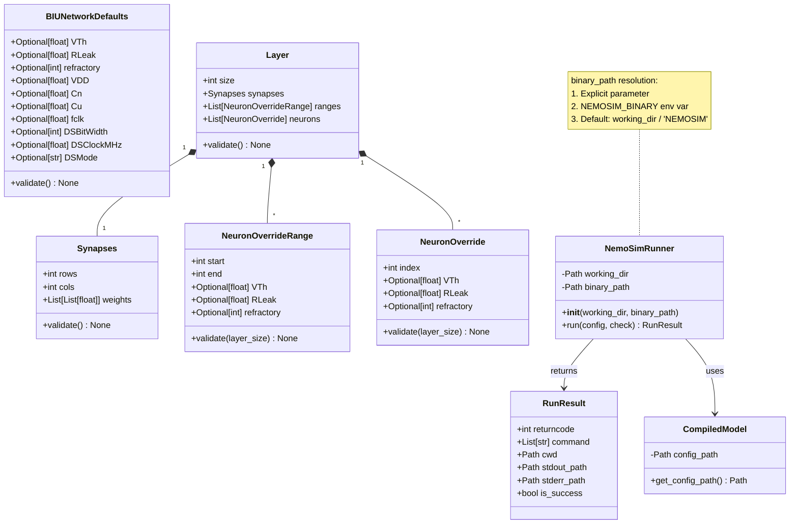

# NemoSDK Class Diagram

```mermaid
classDiagram
    class BIUNetworkDefaults {
        +Optional[float] VTh
        +Optional[float] RLeak
        +Optional[int] refractory
        +Optional[float] VDD
        +Optional[float] Cn
        +Optional[float] Cu
        +Optional[float] fclk
        +Optional[int] DSBitWidth
        +Optional[float] DSClockMHz
        +Optional[str] DSMode
        +validate() None
    }

    class Synapses {
        +int rows
        +int cols
        +List[List[float]] weights
        +validate() None
    }

    class NeuronOverrideRange {
        +int start
        +int end
        +Optional[float] VTh
        +Optional[float] RLeak
        +Optional[int] refractory
        +validate(layer_size) None
    }

    class NeuronOverride {
        +int index
        +Optional[float] VTh
        +Optional[float] RLeak
        +Optional[int] refractory
        +validate(layer_size) None
    }

    class Layer {
        +int size
        +Synapses synapses
        +List[NeuronOverrideRange] ranges
        +List[NeuronOverride] neurons
        +validate() None
    }

    class CompiledModel {
        -Path config_path
        +get_config_path() Path
    }

    class NemoSimRunner {
        -Path working_dir
        -Path binary_path
        +__init__(working_dir, binary_path)
        +run(config, check) RunResult
    }
    
    note for NemoSimRunner "binary_path resolution:<br/>1. Explicit parameter<br/>2. NEMOSIM_BINARY env var<br/>3. Default: working_dir / 'NEMOSIM'"

    class RunResult {
        +int returncode
        +List[str] command
        +Path cwd
        +Path stdout_path
        +Path stderr_path
        +bool is_success
    }

    Layer "1" *-- "1" Synapses
    Layer "1" *-- "*" NeuronOverrideRange
    Layer "1" *-- "*" NeuronOverride
    NemoSimRunner --> RunResult : returns
    NemoSimRunner --> CompiledModel : uses
```
