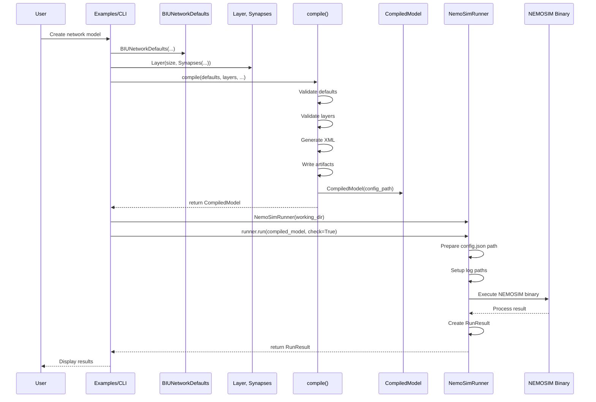

# NemoSDK Sequence Diagram - Compile and Run Workflow

```mermaid
sequenceDiagram
    participant User
    participant CLI as Examples/CLI
    participant Defaults as BIUNetworkDefaults
    participant Model as Layer, Synapses
    participant Compiler as compile()
    participant Compiled as CompiledModel
    participant Runner as NemoSimRunner
    participant Sim as NEMOSIM Binary

    User->>CLI: Create network model
    CLI->>Defaults: BIUNetworkDefaults(...)
    CLI->>Model: Layer(size, Synapses(...))
    
    CLI->>Compiler: compile(defaults, layers, ...)
    Compiler->>Compiler: Validate defaults
    Compiler->>Compiler: Validate layers
    Compiler->>Compiler: Generate XML
    Compiler->>Compiler: Write artifacts
    Compiler->>Compiled: CompiledModel(config_path)
    Compiler-->>CLI: return CompiledModel

    CLI->>Runner: NemoSimRunner(working_dir)
    CLI->>Runner: runner.run(compiled_model, check=True)
    Runner->>Runner: Prepare config.json path
    Runner->>Runner: Setup log paths
    Runner->>Sim: Execute NEMOSIM binary
    Sim-->>Runner: Process result
    Runner->>Runner: Create RunResult
    Runner-->>CLI: return RunResult

    CLI-->>User: Display results
```
